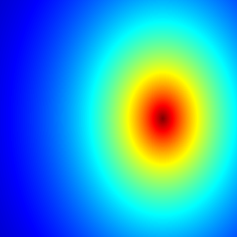

***

## About the Mandelbrot set:

See here: <https://en.wikipedia.org/wiki/Mandelbrot_set>

## Code

```{r setup, include=TRUE, warning=FALSE}
knitr::opts_chunk$set(echo = TRUE)
library(caTools) # external package providing write.gif function
```

```{r echo=TRUE, warning=FALSE}
jet.colors <- colorRampPalette(c("#00007F", "blue", "#007FFF", "cyan", "#7FFF7F",
                                 "yellow", "#FF7F00", "red", "#7F0000"))
dx <- 400                  # define width
dy <- 400                  # define height
C <- complex( real=rep(seq(-2.2, 1.0, length.out=dx), each=dy ),
              imag=rep(seq(-1.2, 1.2, length.out=dy), dx ) )
C <- matrix(C,dy,dx)       # reshape as square matrix of complex numbers


Z <- list(0,0,0,0,0) # initialize Z to zero

# initialize output 3D arrays
X<- list(array(0, c(dy,dx,100)),
	 array(0, c(dy,dx,100)),
	 array(0, c(dy,dx,100)),
	 array(0, c(dy,dx,100)),
	 array(0, c(dy,dx,100)))


for (k in 1:100) {          	     # loop with 100 iterations
  for (i in 1:5){
  twoI <- 2*i
  Z[[i]]<- Z[[i]]^(twoI) + C         # the central difference equation
  
  X[[i]][,,k] <- exp(-abs(Z[[i]]))   # capture results
  }
}

# Create all the images
for (i in 1:5){
	filename <- paste("Mandelbrot",as.character(i),"a.gif",sep = "")
	write.gif(X[[i]], filename, col=jet.colors, delay=100)
}

```

## Results

### Mandelbrot set ( $z = z^2 + c$)

</img>

### Another fractal ($z = z^4 + c$)

</img>

### Another fractal ($z = z^6 + c$)

</img>

### Another fractal ($z = z^8 + c$)

</img>

### Another fractal ($z = z^{10} + c$)

</img>


## Sources

* Whoever wrote this cool example: <https://en.wikipedia.org/wiki/R_(programming_language)#Programming_features>
* How to compile a Rmarkdown notebook to html: <http://kbroman.org/knitr_knutshell/pages/Rmarkdown.html>
