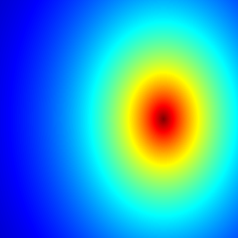

***

## About the Mandelbrot set:

See here: <https://en.wikipedia.org/wiki/Mandelbrot_set>

## Code

```r setup, include=TRUE, warning=FALSE
knitr::opts_chunk$set(echo = TRUE)
library(caTools) # external package providing write.gif function
```

```r, echo=TRUE, warning=FALSE
jet.colors <- colorRampPalette(c("#00007F", "blue", "#007FFF", "cyan", "#7FFF7F",
                                 "yellow", "#FF7F00", "red", "#7F0000"))
dx <- 400                  # define width
dy <- 400                  # define height
C <- complex( real=rep(seq(-2.2, 1.0, length.out=dx), each=dy ),
              imag=rep(seq(-1.2, 1.2, length.out=dy), dx ) )
C <- matrix(C,dy,dx)       # reshape as square matrix of complex numbers


Z <- list(0,0,0,0,0)

# initialize output 3D array
X<- list(array(0, c(dy,dx,100)),array(0, c(dy,dx,100)),array(0, c(dy,dx,100)),
	 array(0, c(dy,dx,100)),array(0, c(dy,dx,100)))

for (k in 1:100) {		    # loop with 100 iterations
  for (i in 1:5){
  twoI <- 2*i
  Z[[i]]<- Z[[i]]^(twoI) + C         # the central difference equation
  
  X[[i]][,,k] <- exp(-abs(Z[[i]]))   # capture results
  }
}

for (i in 1:5){
	filename <- paste("Mandelbrot","0",as.character(i),"b.gif",sep = "")
	write.gif(X[[i]], filename, col=jet.colors, delay=100)
}

# Second cycle 6 - 10

Z <- list(0,0,0,0,0)

for (k in 1:100) {          	    # loop with 100 iterations
  for (i in 1:5){
  twoI <- 2*(i + 5)
  Z[[i]]<- Z[[i]]^(twoI) + C         # the central difference equation

  X[[i]][,,k] <- exp(-abs(Z[[i]]))   # capture results
  }
}

for (i in 1:5){
        filename <- paste("Mandelbrot","0",as.character(i),"c.gif",sep = "")
        write.gif(X[[i]], filename, col=jet.colors, delay=100)
}

# Third cycle 11 - 15

Z <- list(0,0,0,0,0)

for (k in 1:100) {          	     # loop with 100 iterations
  for (i in 1:5){
  twoI <- 2*(i + 10)
  Z[[i]]<- Z[[i]]^(twoI) + C         # the central difference equation

  X[[i]][,,k] <- exp(-abs(Z[[i]]))   # capture results
  }
}

for (i in 1:5){
        filename <- paste("Mandelbrot","0",as.character(i),"d.gif",sep = "")
        write.gif(X[[i]], filename, col=jet.colors, delay=100)
}


# Fourth cycle 16 - 20

Z <- list(0,0,0,0,0)

for (k in 1:100) {          	     # loop with 100 iterations
  for (i in 1:5){
  twoI <- 2*(i + 15)
  Z[[i]]<- Z[[i]]^(twoI) + C         # the central difference equation

  X[[i]][,,k] <- exp(-abs(Z[[i]]))   # capture results
  }
}

for (i in 1:5){
        filename <- paste("Mandelbrot","0",as.character(i),"e.gif",sep = "")
        write.gif(X[[i]], filename, col=jet.colors, delay=100)
}


```

## Results

### Mandelbrot set ( $z = z^2 + c$)

</img>

### Another fractal ($z = z^4 + c$)

</img>

### Another fractal ($z = z^6 + c$)

</img>

### Another fractal ($z = z^8 + c$)

</img>

### Another fractal ($z = z^{10} + c$)

</img>


### Another fractal ($z = z^{12} + c$)

</img>

### Another fractal ($z = z^{14} + c$)

</img>

### Another fractal ($z = z^{16} + c$)

</img>

### Another fractal ($z = z^{18} + c$)

</img>

### Another fractal ($z = z^{20} + c$)

</img>


### Another fractal ($z = z^{22} + c$)

</img>

### Another fractal ($z = z^{24} + c$)

</img>

### Another fractal ($z = z^{26} + c$)

</img>

### Another fractal ($z = z^{28} + c$)

</img>

### Another fractal ($z = z^{30} + c$)

</img>


### Another fractal ($z = z^{32} + c$)

</img>

### Another fractal ($z = z^{34} + c$)

</img>

### Another fractal ($z = z^{36} + c$)

</img>

### Another fractal ($z = z^{38} + c$)

</img>

### Another fractal ($z = z^{40} + c$)

</img>

## Sources

* [Whoever wrote this cool example](https://en.wikipedia.org/w/index.php?title=R_(programming_language)&oldid=783709493#Mandelbrot_set).
* [How to compile a Rmarkdown notebook to html](http://kbroman.org/knitr_knutshell/pages/Rmarkdown.html).
