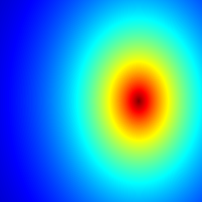

***

### About Mandelbrot set:

See here: <https://en.wikipedia.org/wiki/Mandelbrot_set>


### Code

```{r setup, include=TRUE, warning=FALSE}
knitr::opts_chunk$set(echo = TRUE)
library(caTools) # external package providing write.gif function
```

```{r echo=TRUE, warning=FALSE}
jet.colors <- colorRampPalette(c("#00007F", "blue", "#007FFF", "cyan", "#7FFF7F",
                                 "yellow", "#FF7F00", "red", "#7F0000"))
dx <- 400                  # define width
dy <- 400                  # define height
C <- complex( real=rep(seq(-2.2, 1.0, length.out=dx), each=dy ),
              imag=rep(seq(-1.2, 1.2, length.out=dy), dx ) )
C <- matrix(C,dy,dx)       # reshape as square matrix of complex numbers
Z1 <- 0                     # initialize Z to zero
Z2 <- 0
X1 <- array(0, c(dy,dx,100)) # initialize output 3D array
X2 <- X1
for (k in 1:100) {          # loop with 20 iterations
  Z1 <- Z1^2 + C               # the central difference equation
  Z2 <- Z2^4 + C
  X1[,,k] <- exp(-abs(Z1))   # capture results
  X2[,,k] <- exp(-abs(Z2))
}
write.gif(X1, "Mandelbrot222.gif", col=jet.colors, delay=100)
write.gif(X2, "Mandelbrot333.gif", col=jet.colors, delay=100)

```

### Results

## Mandelbrot set ( $z = z^2 + c$)

</img>

### Another fractal ($z = z^4 + c$)

#</img>

### Source

* Whoever wrote this cool example: <https://en.wikipedia.org/wiki/R_(programming_language)#Programming_features>
* How to compile a Rmarkdown notebook to html: <http://kbroman.org/knitr_knutshell/pages/Rmarkdown.html>

