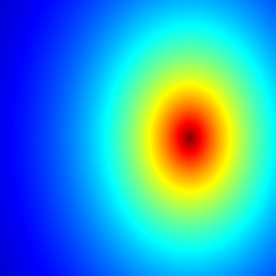

## Some general comments

So, I've just learned how to use `knitr`, and this small project
is just testing it out. You can check the R markdown files which 
produced the GIFs at the end (or [here](https://github.com/mlliarm/fractals/blob/master/Fractals2.Rmd) 
and [here](https://github.com/mlliarm/fractals/blob/master/Fractals3.Rmd), if you're in a hurry).

Besides producing the images it also creates a cool report in html format.

To compile the `.Rmd` file you'll just have to type in your favorite shell (assuming you're on GNU/Linux):

      R -e "rmarkdown::render('Fractals2.Rmd')"

## Mandelbrot set

Using the complex map `z = z^2 + c`:

## Variations of the Mandelbrot set

* Using the map `z = z^4 + c`:

* Using the map `z = z^6 + c`:

* Using the  map `z = z^8 + c`

* Using the map `z = z^10 + c`

## R markdown

* [Code](https://github.com/mlliarm/fractals/blob/master/Fractals2.Rmd)
* [Extended code](https://github.com/mlliarm/fractals/blob/master/Fractals3.Rmd)

## Licence

[GPL v3](https://github.com/mlliarm/fractals/blob/master/LICENSE)
